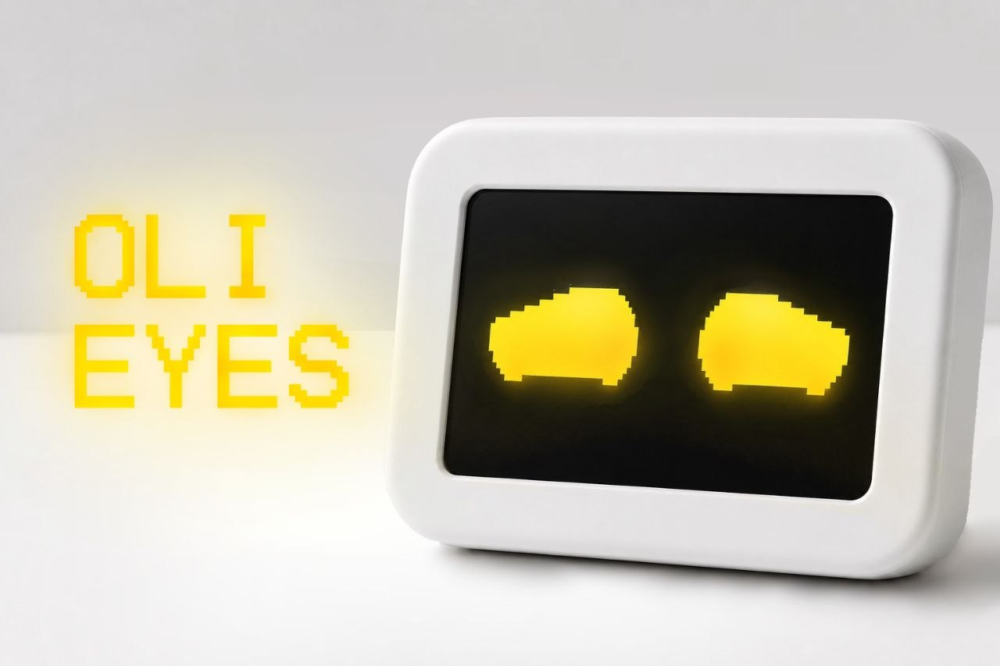
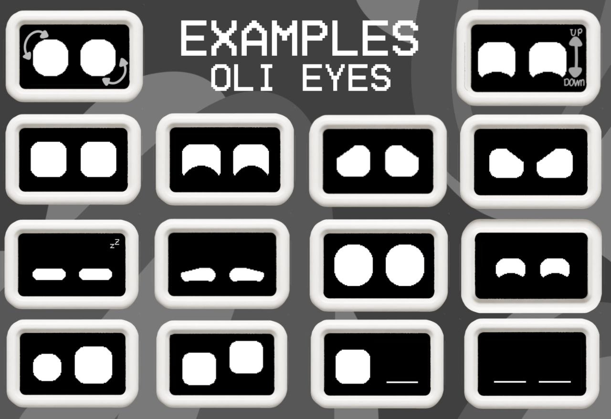

# OliEyes 👀
Expressive, procedurally-animated robot eyes for OLED displays on Arduino and ESP32.

## 💡 How It Works
1. This code draws smooth robot eyes on OLED displays using the [Adafruit GFX Library](https://github.com/adafruit/Adafruit-gfx-library).
2. It supports [Adafruit_SSD1306](https://github.com/adafruit/adafruit_ssd1306) (often used for 0.96-inch displays) and [Adafruit_SH110X](https://github.com/adafruit/Adafruit_SH110X) (often used for 1.3-inch displays) libraries.
## ✨ Features
- 🎭 **20 eye emotions**
- ⚡ **Smooth animations**
- 📺 **SSD1306 / SH1106 128×64 OLED support**
- 🤖 **ESP32 & Arduino support** (Arduino Mega or better; Arduino Uno/Nano are not supported due to memory limits)
- 🎨 **Easy to customize**
- 🖥️ **Live control via Serial Monitor** — switch moods, trigger gestures, and tune timing without re-flashing

A wide variety of customizable emotions are available out of the box (more updates coming soon)!

## ⬇️ Installation
1. **Download** this repository as a ZIP file (or clone it).
2. **Open the sketch** from the `examples` folder that matches your OLED display using the Arduino IDE.
3. **Install the required libraries for your I2C display** (Adafruit GFX and SSD1306/SH110X).
4. **Click "Upload"** to flash the code to your board.
5. 🎉 **Enjoy!**

## 🕹️ Serial Monitor Commands
Open the Serial Monitor at **115200 baud** (line ending: Newline) and try:

| Command | What it does |
|---|---|
| `<mood name>` | Switch directly to that mood, e.g. `happy` |
| `list` | Print every available mood name |
| `demo` | Resume automatic mood cycling |
| `blink` | Trigger a normal two-eye blink |
| `wink` / `winkright` | Trigger a right-eye wink |
| `winkleft` | Trigger a left-eye wink |
| `doubletake` | Startled glance + blink gesture |
| `interval <ms>` | Base time between moods in demo mode |
| `speed <1-100>` | How fast eye shapes morph into a new mood |
| `help` | Show the full command list |

## Connection Diagram 🔗

=== ESP32 — classic (most DevKit boards) ===
```
   ESP32 DevKit                    OLED (SSD1306 / SH1106)
   ┌─────────────────┐             ┌─────────────────┐
   │             3V3 ●─────────────● VCC             │
   │             GND ●─────────────● GND             │
   │         GPIO21  ●─────────────● SDA             │
   │         GPIO22  ●─────────────● SCL             │
   └─────────────────┘             └─────────────────┘
```

=== ESP32-C3 (SuperMini / generic "ESP32C3 Dev Module") ===
(software default per the Arduino core - don't confuse with UART,
which defaults to GPIO20/21 on this chip. Some clone boards route
their physical pin headers differently - check silkscreen if this
doesn't work out of the box)
```
   ESP32-C3                         OLED (SSD1306 / SH1106)
   ┌─────────────────┐              ┌─────────────────┐
   │             3V3 ●──────────────● VCC             │
   │             GND ●──────────────● GND             │
   │          GPIO8  ●──────────────● SDA             │
   │          GPIO9  ●──────────────● SCL             │
   └─────────────────┘              └─────────────────┘
```

=== Arduino Mega / Mega2560 ===
```
   Arduino Mega                    OLED (SSD1306 / SH1106)
   ┌─────────────────┐             ┌─────────────────┐
   │              5V ●─────────────● VCC             │
   │             GND ●─────────────● GND             │
   │          Pin 20 ●─────────────● SDA             │
   │          Pin 21 ●─────────────● SCL             │
   └─────────────────┘             └─────────────────┘
```

=== Any other board ===
```
   Wire VCC/GND/SDA/SCL to your board's default I2C pins - the
   sketch calls Wire.begin() with no arguments, so it automatically
   uses whatever pins the Arduino core sets as default for your
   selected board.
```

=== Arduino Uno / Nano — NOT SUPPORTED ===
   (compiles, but display.begin() fails: only 2KB RAM, needs 8KB+)
